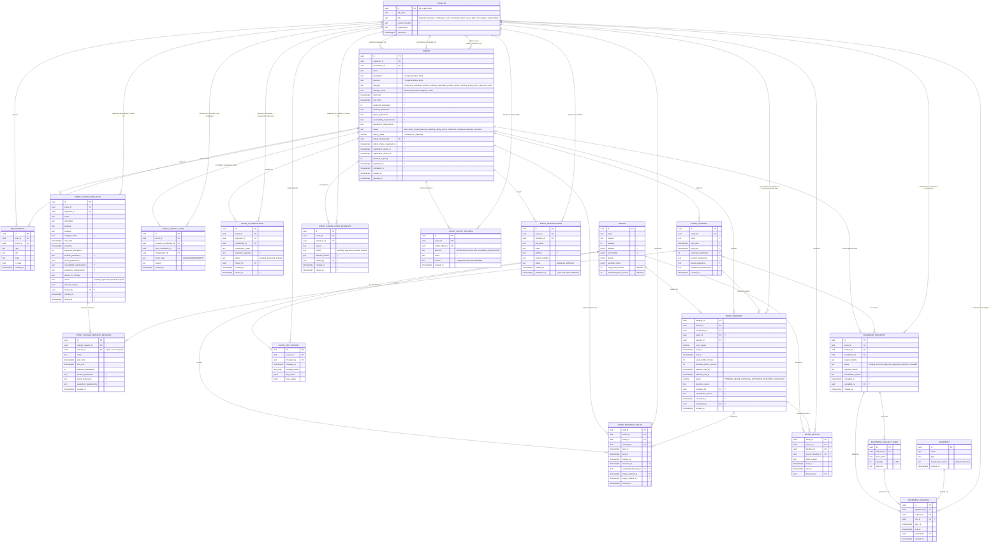

# ConnectSphere — ER Diagram

```mermaid
erDiagram
    %% ---------- People ----------
    PROFILES ||--o{ EVENTS : "organises (organiser_id)"
    PROFILES |o--o{ EVENTS : "coordinates (coordinator_id)"
    PROFILES |o--o{ EVENTS : "safety-reviews (safety_reviewed_by)"
    PROFILES ||--o{ NOTIFICATIONS : receives

    %% ---------- Event lifecycle ----------
    EVENTS ||--o{ EVENT_SESSIONS : "split into"
    EVENTS ||--o{ EVENT_ACTIVITY_LOGS : "coordinator assignment history"
    PROFILES ||--o{ EVENT_ACTIVITY_LOGS : "changed by / previous / new coordinator"
    EVENTS ||--o{ EVENT_CLARIFICATIONS : "clarified via"
    PROFILES ||--o{ EVENT_CLARIFICATIONS : "asked by coordinator / answered by organiser"
    EVENTS ||--o{ EVENT_CHANGE_REQUESTS : "amended via"
    PROFILES ||--o{ EVENT_CHANGE_REQUESTS : "requested by organiser / closed by"
    EVENT_CHANGE_REQUESTS ||--o{ EVENT_CHANGE_REQUEST_SESSIONS : "proposes sessions"
    EVENT_SESSIONS |o--o{ EVENT_CHANGE_REQUEST_SESSIONS : "changes"
    EVENTS ||--o{ EVENT_CANCELLATION_REQUESTS : "cancelled via"
    PROFILES ||--o{ EVENT_CANCELLATION_REQUESTS : "requested by organiser / closed by"
    EVENTS o|--o{ NOTIFICATIONS : "relates to"

    %% ---------- Safety ----------
    EVENTS ||--o{ EVENT_SAFETY_REVIEWS : "safety-checked in"
    PROFILES ||--o{ EVENT_SAFETY_REVIEWS : "decided by safety officer"

    %% ---------- Registration ----------
    EVENTS ||--o{ EVENT_REGISTRATIONS : accepts
    PROFILES ||--o{ EVENT_REGISTRATIONS : "registers as attendee"

    %% ---------- Venues ----------
    VENUES ||--o{ VENUE_BOOKINGS : "booked for"
    EVENTS o|--o{ VENUE_BOOKINGS : requests
    EVENT_SESSIONS o|--o{ VENUE_BOOKINGS : "venue for session"
    PROFILES ||--o{ VENUE_BOOKINGS : "requested by coordinator / reviewed / cancelled by"
    VENUES ||--o{ VENUE_TENTATIVE_HOLDS : "held for"
    EVENTS ||--o{ VENUE_TENTATIVE_HOLDS : "temporarily reserves"
    PROFILES ||--o{ VENUE_TENTATIVE_HOLDS : "created by"
    VENUE_BOOKINGS |o--o{ VENUE_TENTATIVE_HOLDS : "completes"
    VENUES ||--o{ VENUE_BLOCKS : "blocked in"
    VENUE_BOOKINGS |o--o{ VENUE_BLOCKS : "reservation source"
    PROFILES ||--o{ VENUE_BLOCKS : "issued by"
    VENUES ||--o{ VENUE_EDIT_HISTORY : "has edit history"
    PROFILES ||--o{ VENUE_EDIT_HISTORY : "made changes"

    %% ---------- Equipment ----------
    EVENTS ||--o{ EQUIPMENT_REQUESTS : "needs equipment via"
    EVENT_SESSIONS o|--o{ EQUIPMENT_REQUESTS : "for session"
    PROFILES ||--o{ EQUIPMENT_REQUESTS : "submitted by coordinator / cancelled by"
    EQUIPMENT_REQUESTS ||--o{ EQUIPMENT_REQUEST_LINES : "lists items"
    EQUIPMENT_REQUESTS ||--o{ EQUIPMENT_BOOKINGS : "fulfilled by"
    EQUIPMENT_REQUEST_LINES |o--o{ EQUIPMENT_BOOKINGS : "allocated to line"
    EQUIPMENT ||--o{ EQUIPMENT_BOOKINGS : "booked unit"
    PROFILES ||--o{ EQUIPMENT_BOOKINGS : "created by tech support"

    PROFILES {
        uuid id PK "FK to auth.users"
        text full_name
        text role "organiser, attendee, coordinator, event_coordinator_lead, venue_staff, tech_support, safety_officer"
        text contact_number "?"
        text organization "?"
        timestamptz created_at
    }

    EVENTS {
        uuid id PK
        uuid organiser_id FK
        uuid coordinator_id FK "?"
        text name
        text description "? (required unless draft)"
        text purpose "? (required unless draft)"
        text category "conference, workshop, seminar, meeting, networking, product_launch, training, social_event, ceremony, other"
        text category_other "required only when category = other"
        timestamptz start_time "?"
        timestamptz end_time "?"
        int expected_attendance "?"
        text location_preference "?"
        text layout_preference "?"
        text accessibility_requirements "?"
        text equipment_requirements "?"
        text status "draft, under_review, planning, awaiting_safety_check, confirmed, completed, rejected, cancelled"
        varchar safety_status "? default not_requested"
        uuid safety_reviewed_by FK "?"
        timestamptz safety_check_requested_at "?"
        timestamptz registration_opens_at "?"
        timestamptz registration_closes_at "?"
        int attendee_capacity "?"
        timestamptz published_at "?"
        timestamptz completed_at "?"
        timestamptz created_at
        timestamptz updated_at
    }

    EVENT_SESSIONS {
        uuid id PK
        uuid event_id FK
        text name "?"
        timestamptz start_time "?"
        timestamptz end_time "?"
        int expected_attendance "?"
        text location_preference "?"
        text layout_preference "?"
        text equipment_requirements "?"
        timestamptz created_at
    }

    EVENT_ACTIVITY_LOGS {
        uuid id PK
        uuid event_id FK
        uuid previous_coordinator_id FK "?"
        uuid new_coordinator_id FK
        uuid changed_by_id FK
        text action_type "default REASSIGNMENT"
        text reason "?"
        timestamptz created_at
    }

    EVENT_CLARIFICATIONS {
        uuid id PK
        uuid event_id FK
        uuid organiser_id FK
        uuid coordinator_id FK
        text coordinator_notes
        text organiser_response "?"
        text status "pending, answered, expired"
        uuid closed_by FK "?"
        timestamptz created_at
        timestamptz closed_at "?"
    }

    EVENT_CHANGE_REQUESTS {
        uuid id PK
        uuid event_id FK
        uuid organiser_id FK
        text name
        text description
        text purpose
        text category
        text category_other "?"
        timestamptz start_time
        timestamptz end_time
        int expected_attendance
        text location_preference "?"
        text layout_preference "?"
        text accessibility_requirements "?"
        text equipment_requirements "?"
        text reason_for_change
        text status "pending, approved, rejected, expired"
        text decision_reason "?"
        uuid closed_by FK "?"
        timestamptz created_at
        timestamptz closed_at "?"
    }

    EVENT_CHANGE_REQUEST_SESSIONS {
        uuid id PK
        uuid change_request_id FK
        uuid session_id FK "? (null = new session)"
        text name
        timestamptz start_time
        timestamptz end_time
        int expected_attendance
        text location_preference "?"
        text layout_preference "?"
        text equipment_requirements "?"
        timestamptz created_at
    }

    EVENT_CANCELLATION_REQUESTS {
        uuid id PK
        uuid event_id FK
        uuid organiser_id FK
        text reason
        text status "pending, approved, rejected, expired"
        text decision_reason "?"
        uuid closed_by FK "?"
        timestamptz created_at
        timestamptz closed_at "?"
    }

    EVENT_SAFETY_REVIEWS {
        uuid id PK
        uuid event_id FK
        uuid safety_officer_id FK
        text decision "APPROVED, REJECTED, CHANGES_REQUESTED"
        text notes "?"
        text reason "? (required unless APPROVED)"
        timestamptz created_at
    }

    EVENT_REGISTRATIONS {
        uuid id PK
        uuid event_id FK
        uuid attendee_id FK
        text full_name
        text email
        text address "?"
        text contact_number "?"
        text status "registered, withdrawn"
        timestamptz created_at
        timestamptz withdrawn_at "? (set only when withdrawn)"
    }

    NOTIFICATIONS {
        uuid id PK
        uuid user_id FK
        uuid event_id FK "?"
        text type
        text title
        text body
        bool is_read
        timestamptz created_at
    }

    VENUES {
        uuid id PK
        text name
        text location "?"
        int capacity
        jsonb facilities "?"
        jsonb accessibility "?"
        jsonb layouts
        jsonb operating_hours
        int setup_time_minutes "default 0"
        int turnaround_time_minutes "default 0"
    }

    VENUE_BOOKINGS {
        uuid booking_id PK
        uuid venue_id FK
        uuid coordinator_id FK
        uuid event_id FK "?"
        uuid session_id FK "?"
        varchar room_layout
        timestamptz start_at
        timestamptz end_at
        int setup_buffer_minutes
        int teardown_buffer_minutes
        timestamptz effective_start_at
        timestamptz effective_end_at
        varchar status "PENDING_VENUE_APPROVAL, APPROVED, REJECTED, CANCELLED"
        text rejection_reason "?"
        uuid reviewed_by FK "?"
        text cancellation_reason "?"
        timestamptz cancelled_at "?"
        uuid cancelled_by FK "?"
        timestamptz created_at
    }

    VENUE_TENTATIVE_HOLDS {
        uuid hold_id PK
        uuid venue_id FK
        uuid event_id FK
        uuid created_by FK
        timestamptz start_at
        timestamptz end_at
        timestamptz expires_at
        timestamptz released_at "?"
        uuid completed_booking_id FK "?"
        timestamptz expiry_claimed_at "?"
        timestamptz expiry_notified_at "?"
        timestamptz created_at
    }

    VENUE_BLOCKS {
        uuid block_id PK
        uuid venue_id FK
        uuid booking_id FK "?"
        uuid source_booking_id FK "?"
        text block_reason
        timestamptz start_at
        timestamptz end_at
        uuid block_issuer FK
    }

    VENUE_EDIT_HISTORY {
        uuid id PK
        uuid venue_id FK
        uuid changed_by FK
        timestamptz changed_at
        text_array changed_fields
        jsonb old_values
        jsonb new_values
    }

    EQUIPMENT {
        uuid id PK
        text name
        text type
        text maintenance_status "default Functional"
        timestamptz created_at
    }

    EQUIPMENT_REQUESTS {
        uuid id PK
        uuid event_id FK
        uuid session_id FK "?"
        uuid coordinator_id FK
        text request_details
        text status "Pending Technical Approval, Approved, Rejected, Cancelled"
        text rejection_reason "?"
        text cancellation_reason "?"
        timestamptz cancelled_at "?"
        uuid cancelled_by FK "?"
        timestamptz created_at
    }

    EQUIPMENT_REQUEST_LINES {
        uuid id PK
        uuid request_id FK
        text item_name
        int quantity "1-100"
        text specifics "?"
    }

    EQUIPMENT_BOOKINGS {
        uuid id PK
        uuid equipment_id FK
        uuid request_id FK
        uuid line_id FK "?"
        timestamptz start_at
        timestamptz end_at
        uuid created_by FK
        timestamptz created_at
    }
```
