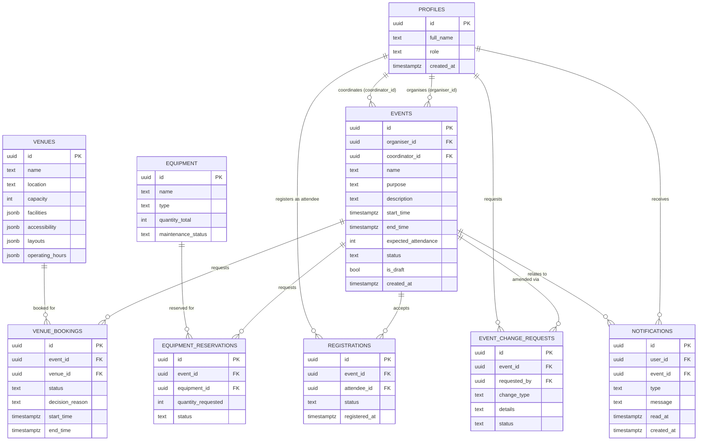

This is Mermaid code: renders automatically as a diagram wherever Mermaid is supported (e.g. GitHub, this Markdown viewer).

```mermaid
erDiagram
    PROFILES ||--o{ EVENTS : "organises (organiser_id)"
    PROFILES ||--o{ EVENTS : "coordinates (coordinator_id)"
    EVENTS ||--o{ VENUE_BOOKINGS : requests
    VENUES ||--o{ VENUE_BOOKINGS : "booked for"
    EVENTS ||--o{ EQUIPMENT_RESERVATIONS : requests
    EQUIPMENT ||--o{ EQUIPMENT_RESERVATIONS : "reserved for"
    EVENTS ||--o{ REGISTRATIONS : accepts
    PROFILES ||--o{ REGISTRATIONS : "registers as attendee"
    EVENTS ||--o{ EVENT_CHANGE_REQUESTS : "amended via"
    PROFILES ||--o{ EVENT_CHANGE_REQUESTS : requests
    PROFILES ||--o{ NOTIFICATIONS : receives
    EVENTS ||--o{ NOTIFICATIONS : "relates to"

    PROFILES {
        uuid id PK
        text full_name
        text role
        timestamptz created_at
    }

    EVENTS {
        uuid id PK
        uuid organiser_id FK
        uuid coordinator_id FK
        text name
        text purpose
        text description
        timestamptz start_time
        timestamptz end_time
        int expected_attendance
        text status
        bool is_draft
        timestamptz created_at
    }

    VENUES {
        uuid id PK
        text name
        text location
        int capacity
        jsonb facilities
        jsonb accessibility
        jsonb layouts
        jsonb operating_hours
    }

    VENUE_BOOKINGS {
        uuid id PK
        uuid event_id FK
        uuid venue_id FK
        text status
        text decision_reason
        timestamptz start_time
        timestamptz end_time
    }

    EQUIPMENT {
        uuid id PK
        text name
        text type
        int quantity_total
        text maintenance_status
    }

    EQUIPMENT_RESERVATIONS {
        uuid id PK
        uuid event_id FK
        uuid equipment_id FK
        int quantity_requested
        text status
    }

    REGISTRATIONS {
        uuid id PK
        uuid event_id FK
        uuid attendee_id FK
        text status
        timestamptz registered_at
    }

    EVENT_CHANGE_REQUESTS {
        uuid id PK
        uuid event_id FK
        uuid requested_by FK
        text change_type
        text details
        text status
    }

    NOTIFICATIONS {
        uuid id PK
        uuid user_id FK
        uuid event_id FK
        text type
        text message
        timestamptz read_at
        timestamptz created_at
    }
```
